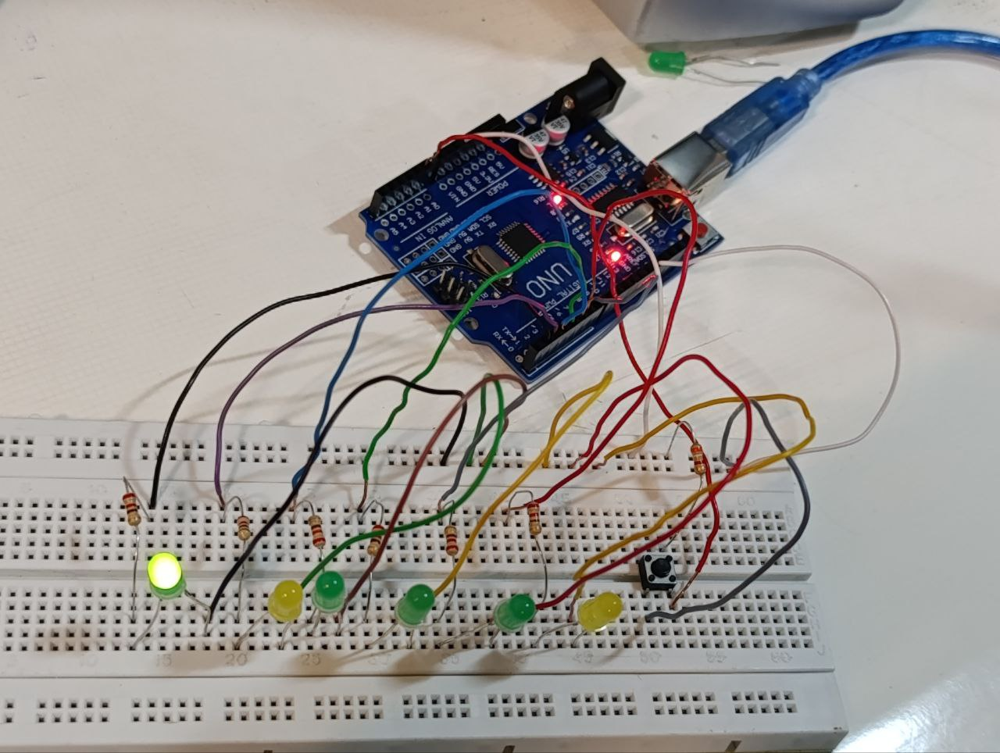

عنوان : برنامه ای بنویسید که با فشردن کلید ، یک عدد تصادفی بین ۱ تا ۶ تولید و در سریال مانیتور چاپ کرده و ال ای دی مربوط به عدد را روشن کند
هدف آزمایش: درست کردن یک تاس الکترونیکی
ابزار و تجهیزات : ۶ عدد ال ای دی، بردبورد، برد آردینو ، سیم مخابراتی ، کلید ، ۶ عدد مقاومت ۲.۲ و یک عدد مقاومت ۱ کیلو
 شرح آزمایش:   
"بخش مدار"
با کابل  برد آردینو را به سیستم متصل میکنیم
 لامپ را در یک ردیف از برد بورد قرار می دهیم و برای هر لامپ ، مقاومتی به اندازه ۲.۲ کیلو اهم در یک ستون از پایه های مثبت قرار داده و  هر مقاومت را با سیم به پایه های شماره ۱ تا ۶ متصل می کنیم
و پایه منفی ال ای دی ها را به بخش زمین برد بورد متصل میکنیم
کلید را بین دو بخش میانی برد بورد وصل می کنیم 
0Aیکی از پایه های کلید را به
  برد آردینو و پایه روبه رو آن را با مقاومت ۱ کیلو اهمی به بخش اول برد بورد اتصال می دهیم و با یک سیم که به ۵ ولت برد آردینو متصل است ردیفی که مقاومت کلید متصل است را دارای ولتاژ ۵ می کنیم
و یکی از پایه های باقی مانده را به زمین متصل میکنیم



"بخش کد"
ابتدا پین کلید و ال ای دی های متصل به آردینو را تعریف میکنیم
ستاپ : با یک حلقه حالت ال ای دی ها را مشخص میکنیم
حالت کلید را تعیین میکنیم
و دستور
*randomSeed(analogRead(0))
 برای جلوگیری از تکرار توالی اعداد تصادفی و تنوع بیشتر در تولید اعداد تصادفی است
لوپ : با یک حلقه همه ال ای دی ها را خاموش میکنیم و با دستور شرطی چک میکنیم اگر کلید فشرده شده باشد یک عدد تصادفی بین ۱ تا ۶ تولید و در سریال مانیتور نمایش داده و ال ای دی متصل به پین عدد ، روشن شود 
و این کار با وقفه ۱ ثانیه ای تکرار می شود

```ccp

#define key1 digitalRead(A0)//تعریف پین کلید
const int ledPins[] = {1, 2, 3, 4, 5, 6};
//پین‌های LED برای اعداد 1 تا 6

void setup() {
  Serial.begin(9600);//راه‌اندازی ارتباط سریال

  for (int i = 0; i < 6; i++) {
    pinMode(ledPins[i], OUTPUT);//راه‌اندازی ارتباط سریال
  }
  pinMode(A0, INPUT);//پین کلید به عنوان ورودی
  randomSeed(analogRead(0));//تنوع در اعداد تصادفی
}

void loop() {
  for (int i = 0; i < 6; i++) {
    digitalWrite(ledPins[i], LOW);   // خاموش کردن تمام LEDها
  }
  if (key1 == 0) {
    int randomNumber = random(0, 6);// تولید عدد تصادفی بین 1 تا6
    digitalWrite(ledPins[randomNumber], HIGH);   // روشن کردن LED مربوط به عدد تصادفی
    Serial.print("Random Number: ");
    Serial.println(randomNumber+1);// چاپ عدد تصادفی در سریال مانیتور
    delay(1000);
  }
}
```
نتیجه گیری:
پس از آپلود و باز کردن سریال مانیتور خواهیم دید که با فشردن کلید ک عدد تصادفی بین ۱ تا ۶ تولید می‌کند. این عدد در سریال مانیتور نمایش داده شده و ال ای دی مربوط به آن عدد روشن می‌شود

