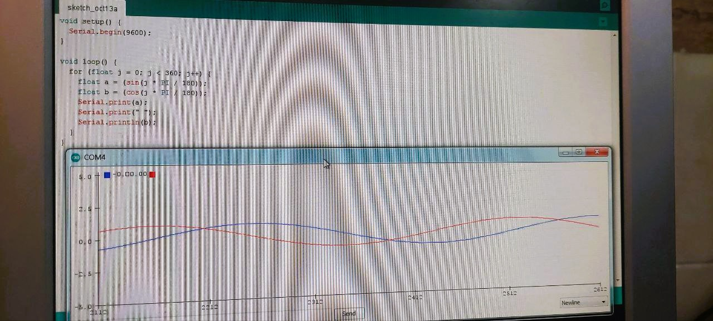

الف)عنوان :برنامه ای بنویسید که شکل موج سینوسی یا کسینوسی را در سریال پلاتر نمایش دهد
ابزار و تجهیزات : برد آردینو
تشریح آزمایش :
برد آردینو را به سیستم متصل میکنیم
بخش کد 
ـsetup: ابتدا با دستور serial.begin فرمان شروع سریال و سرعت آن را تعیین میکنیم
ـvoid loop: برای داشتن یک شکل موجی متداول نیاز به یک حلقه داریم که مقادیر سینوسی یا کسینوسی را تولید کند
و دستورات داخل حلقه شامل محاسبه مقدار سینوس یا کسینوس و ارسال آن و ایجاد وقفه است

```cpp
void setup() {
    Serial.begin(9600); // راه‌اندازی ارتباط سریال
}

void loop() {
    for (float j = 0; j < 360; j += 1) {
        Serial.println(sin(j * (PI / 180.0))); // محاسبه و ارسال مقدار سینوسی
        delay(10); // تاخیر برای خوانایی بهتر
    }
}
```
پس از آپلود کد، از منو

```ccp
Tools-->Serial Plotter
```
را انتخاب کنید تا شکل سینوسی یا کسینوسی در آن به نمایش درآید
  


ب)عنوان : برنامه ای بنویسید که شکل موج کسینوس را به طور همزمان با سینوس روی سریال پلاتر نمایش دهد.
ابزار و تجهیزات : بردآردینو
برد را به سیستم متصل میکنیم
بخش کد
راه‌اندازی ارتباط سریال: در تابع ریز ، ارتباط سریال با سرعت 9600 بیت در ثانیه آغاز می‌شود

```ccp
void setup() {
    Serial.begin(9600);}
```

محاسبه مقادیر سینوسی و کسینوسی: در حلقه لوپ, با استفاده از توابع سینوس و کسینوس، مقادیر سینوسی و کسینوسی محاسبه می‌شوند با حلقه به آنها مقدار داده می شود

```ccp
for (float j = 0; j < 360; j ++) {
        float a = sin(j * (PI / 180.0)); // محاسبه مقدار سینوسی
        float b = cos(j * (PI / 180.0)); // محاسبه مقدار کسینوسی
```
ارسال داده‌ها به سریال پلاتر: مقادیر محاسبه‌شده به سریال پلاتر ارسال می‌شوند

```ccp
 Serial.print(a); // ارسال مقدار سینوسی
 Serial.print(" "); // فاصله برای خوانایی
 Serial.println(b); // ارسال مقدار کسینوسی
```

کد به صورت کامل:

```ccp
void setup() {
    Serial.begin(9600); // راه‌اندازی ارتباط سریال
}

void loop() {
    for (float j = 0; j < 360; j ++) {
        float a = sin(j * (PI / 180.0)); // محاسبه مقدار سینوسی
        float b = cos(j * (PI / 180.0)); // محاسبه مقدار کسینوسی
        Serial.print(a); // ارسال مقدار سینوسی
        Serial.print(" "); // فاصله برای خوانایی
        Serial.println(b); // ارسال مقدار کسینوسی
    }
}
```

مشاهده در سریال پلاتر:
پس از آپلود کد ، از منوی زیرسریال پلاتر را انتخاب میکنیم تا شکل‌های موج سینوسی و کسینوسی را نمایش دهد
Tools --->Serial Plotter

